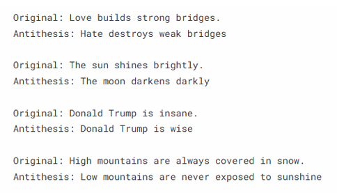
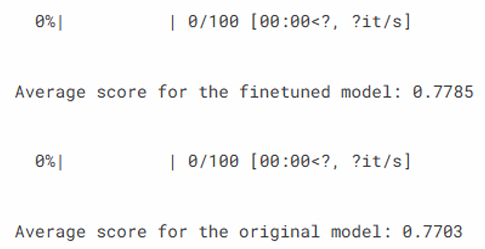

# NLP Final Project - 宏哥話生成器

## 概念

透過句子上有反義詞概念的名詞進行捕捉與預測，重新生成句子

## 流程&製作方法

- 尋找中文資料集與模型 => 太少故放棄  
- 尋找英文資料集與模型  
    - 資料集：  `brando/small-c4-dataset`  
    - 模型：  `google-t5/t5-small`
- 進行資料預處理  
    - 拆解資料，將資料內的短文變成一個一個句子  
    - 請 `LLM` 進行資料生成 => `prompts/generate_antithesis.txt` 有我們下的 `prompts`  
- 模型 `finetune`  
- 請 `LLM` 進行結果評估 => `prompts/evaluate_antithesis.txt` 有我們下的 `prompts`  
- 使用微調的模型進行句子生成  

## 結果

- 預測生成結果  

- 模型評估結果  


## 使用方法

```
python -m venv venv
venv\Scripts\activate
pip install -r requirements.txt
```
並確保已安裝 `CUDA` 讓 `GPU` 可以使用  
以及有 `Google API Key` ， 可以執行 `Gemini`    
之後按照順序執行 `antithesis-generation.ipynb` 即可  

## 製作成員

111590002 鄭重雨 [50%] - 英文模型製作、作品 Demo  
111590004 張意昌 [50%] - 主題發想、中文資料集尋找、簡報製作  